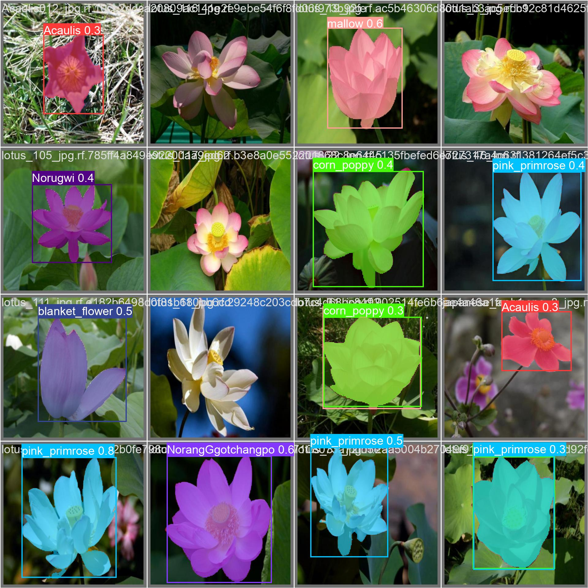
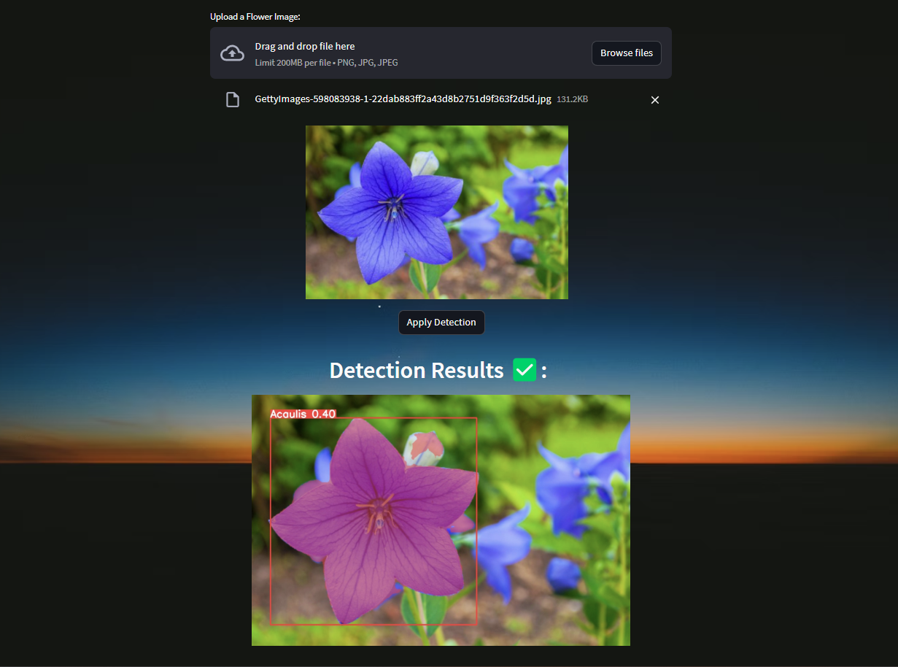

# Flower Instance Segmentation 🌻


## Flower Detection and Instance Segmentation with YOLOv8

The `Flower Detection and Instance Segmentation Model` was trained with over 4000 Flower Images and with YOLOv8 Architecture.



## Check-it out
Test it by running the `app.py` file, built with `Streamlit`.

## Run
```sh
streamlit run app.py
```



## Resources
- Flowers Dataset: https://universe.roboflow.com/flowersdetection/flowers_segmentation
